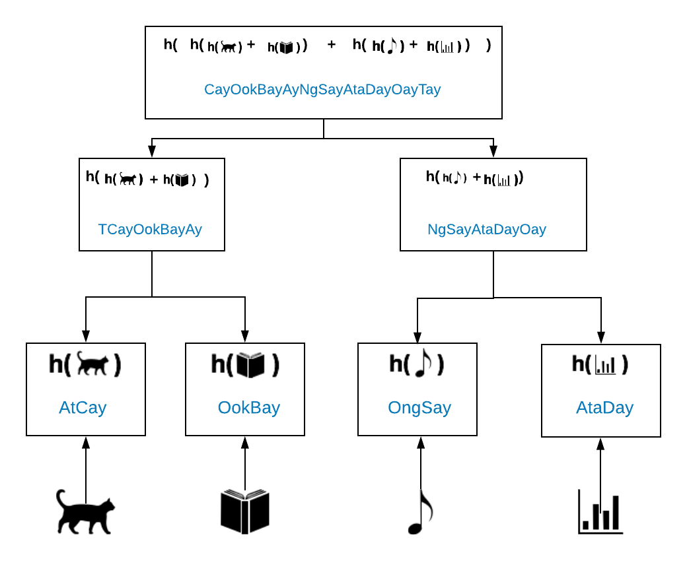
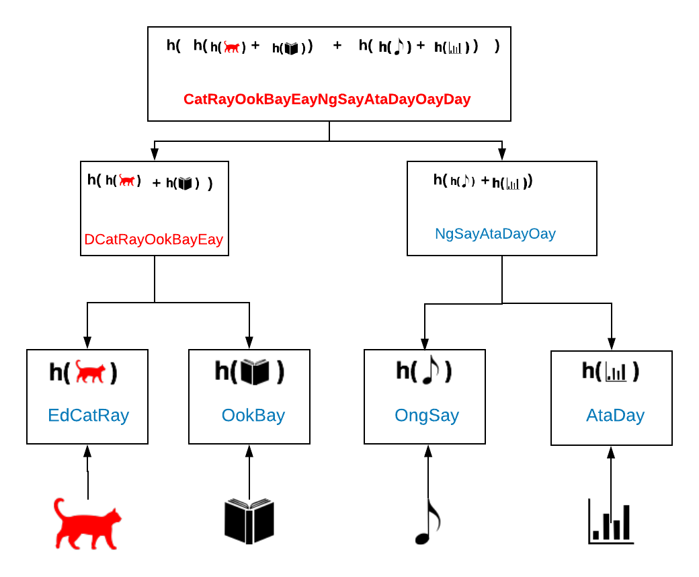
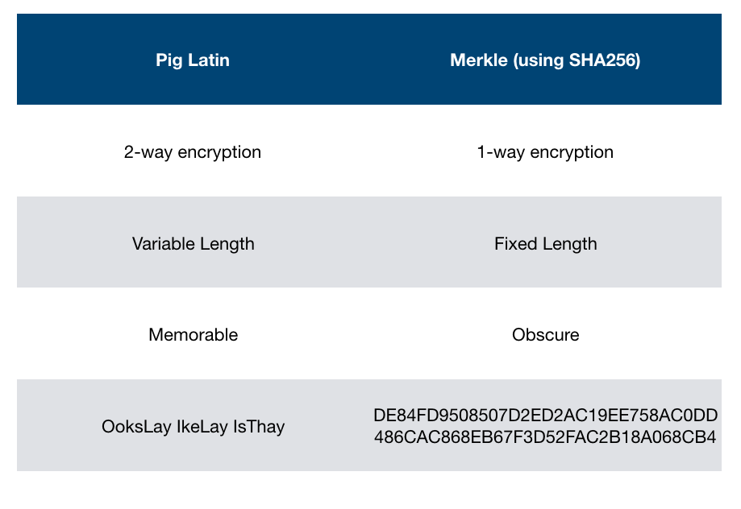

Goal: Summarize [this story](dear-mimi.md) in 3 slides to explain merkle (sans mining) in the context of the distributed web.

One of the things with the distributed web as envisioned by IPFS is that all content has a unique web address, that is independent of where the content is hosted.  So for example, currently, if you have all your cat pictures on Instagram, and Instagram shuts down, all the links you've shared to your cat pictures will no longer work. In this version of the web, your cat pictures will have a unique address that never changes. And if you change your cat picture, your changed cat picture will have its own unique address.  How does this work? 

There's something called a "[Merkle tree](https://en.wikipedia.org/wiki/Merkle_tree)".  Or "Merkle dag". Or "Merkle".  Merkle was the last name of the man who invented this data structure. His first name was Robert. 

A merkle tree is a data structure that, as I like to think of it, encodes history so that you cannot go back and change it. 
Merkle trees are the underlying data structure that allows cryptocurrencies like Bitcoin and Ethereum to function, so it's pretty important that people can't change what happened in Bitcoin because it would be changing who has how much bitcoin / money. Merkle uses a lot of sophisticated math to cryptographically encode the data, but I’m going to explain it using Pig Latin. 

Let’s say we’re looking at some data on your computer and we want to store that data in a snapshot in time, let’s say we’re doing a backup.  You have four things:  

* A picture of your cat
* a PDF of a book, 
* an mp3 of your favorite song, 
* and some data, an excel spreadsheet say: 

[TODO Walk through how the data is stored, explaining the merkle root]. You can easily check with the inputs if it matches the merkle root.

---
Now, let’s say you, or someone else, tries to tamper with your data, and they swap out the picture of your cat with a picture of a red cat. Everything changes up this tree and your merkle root is different. This is a sign that data has been changed and is no longer trustworthy:

---

Merkle trees use a cryptographic function called [SHA256](https://en.wikipedia.org/wiki/SHA-2), which is very complex and safe for bitcoin and content-addressing.  If we built the new web -- or our cryptocurrencies -- on Pig Latin, our file names would grow ridiculously, and it would be easy to hack.  

